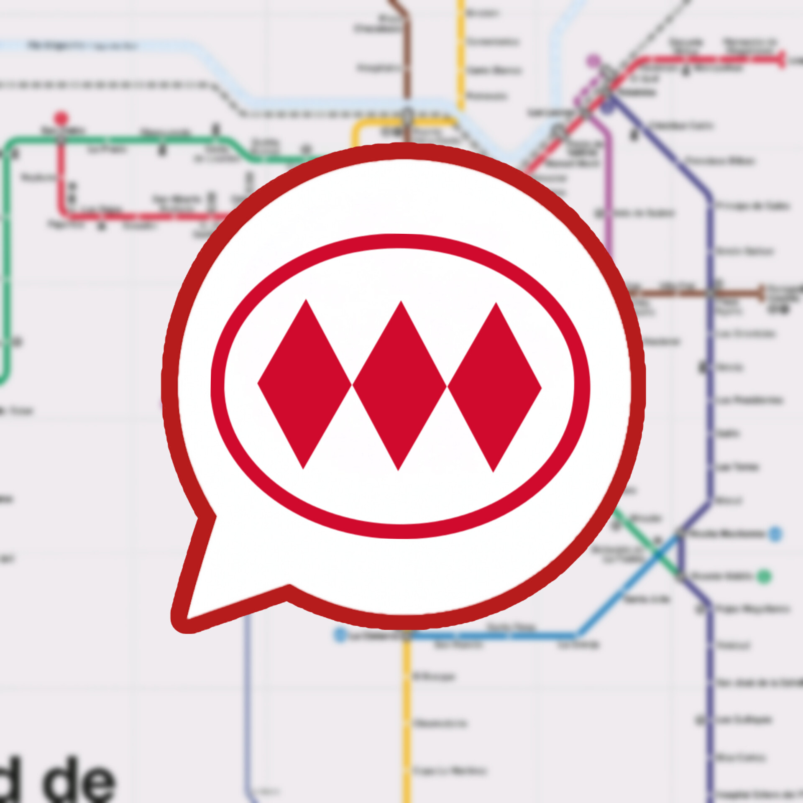
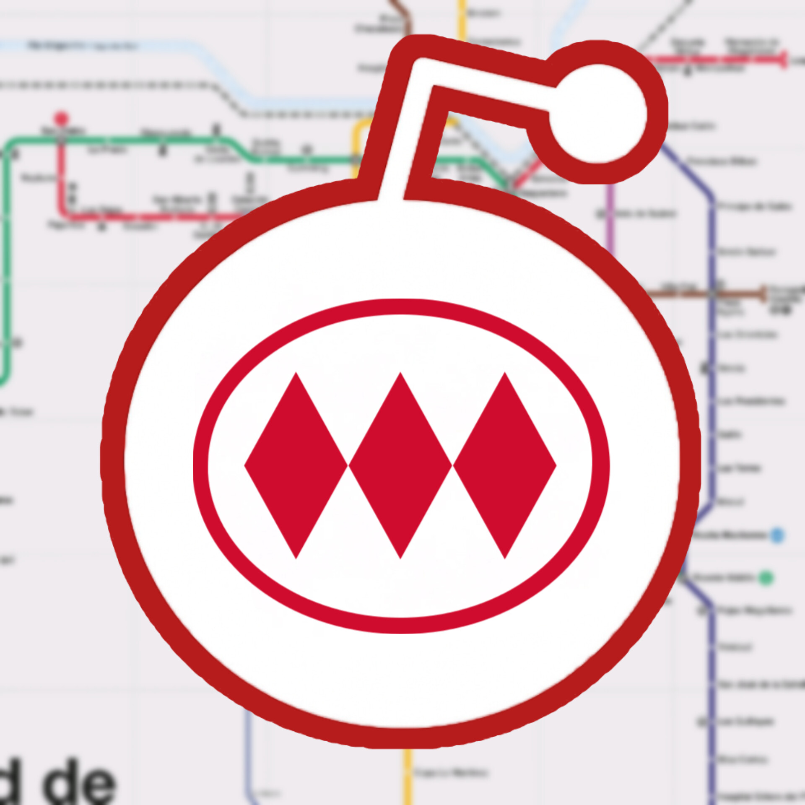

# **Bienvenido/a a la Comunidad No Oficial del Metro de Santiago**  

### **🔗 Únete a la Conversación**  
¡Conéctate con otros amantes del metro! Usa estos enlaces: 

<div style="display: grid; grid-template-columns: repeat(2, 1fr); gap: 20px; margin: 30px 0;">
  <a href="https://discord.gg/z7AfQZZaGD" style="text-align: center;">
    
  </a>
  <a href="https://chat.whatsapp.com/H1ECcZwlVxZFpwmG85GxCB" style="text-align: center;">
    
  </a>
  <a href="https://www.reddit.com/r/metrosantiago/s/S9wvlFkjjF" style="text-align: center;">
    
  </a>
  <a href="https://t.me/metrosantiago" style="text-align: center;">
    
  </a>
  
 
</div>

Un espacio para pasajeros frecuentes y fans del metro de Santiago. Aquí encontrarás actualizaciones, discusiones y recursos sobre la red de transporte y trenes urbanos.  

### **🌟 Qué Ofrecemos**  
- **Información en tiempo real**: Estado de las líneas, alertas de servicio y noticias oficiales.  
- **Discusión y comunidad**: Comparte tips, experiencias o temas no relacionados en canales dedicados.  
- **Recompensas por participación**: Gana reconocimiento según tu actividad en el servidor.  

### **⚠️ Importante**  
```diff  
- NO ESTAMOS ASOCIADOS A METRO S.A.  
```  
Somos una comunidad **independiente** sin vínculo oficial con la empresa.  

**Si representas a Metro S.A. y necesitas contactar al desarrollador del bot**, escribe a `metromanrrss`.  
### **🌐 Enlaces Oficiales del Metro de Santiago**  
- [Sitio web](https://www.metro.cl)  
- [Facebook](https://www.facebook.com/Metrostgo/)  
- [Instagram](https://www.instagram.com/metrodesantiago/)  
- [Twitter/X](https://twitter.com/metrodesantiago)  

**¡Te esperamos para compartir y aprender juntos!** 🚇  
```

